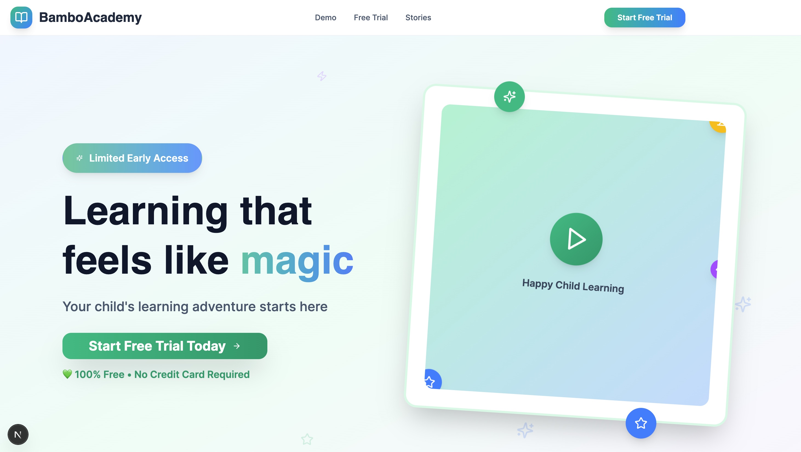
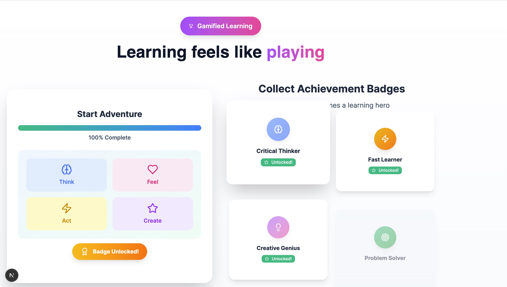
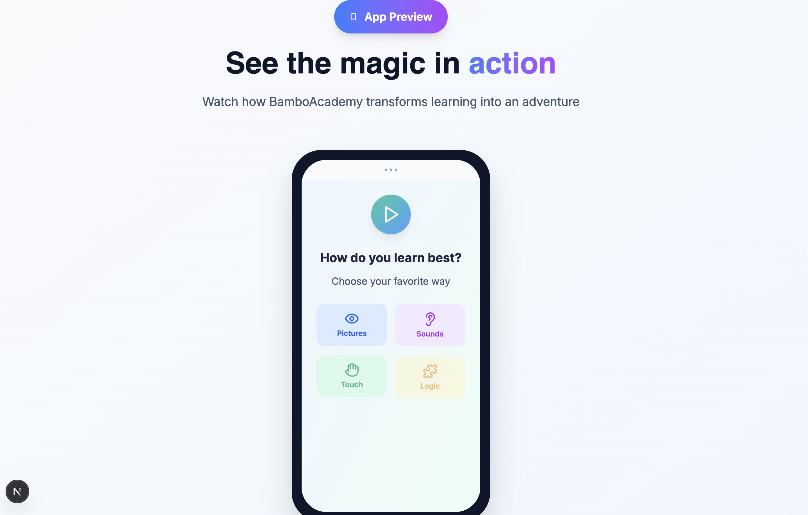

# 🎓 Bambo Academy

### Personalized learning built around the learner — not the curriculum.

Bambo Academy is an early-stage EdTech product concept and MVP designed to create personalized learning experiences based on each learner's personality, interests, preferences, and individual learning style.

The concept explores how adaptive learning, gamification, learner profiling, and AI-assisted personalization can make education more engaging, relevant, and learner-centered.

---

## ✨ Product Vision

Traditional education often delivers the same learning experience to everyone.

Bambo Academy was designed around a different idea:

> What if the learning experience adapted to the student?

The platform aims to understand how each learner prefers to learn and use those insights to shape a more personalized educational journey.

---

## 🏠 Product Experience

### Landing Experience

The product introduces learners and parents to a personalized, engaging learning environment designed around discovery, motivation, and individual progress.

---

## 🧠 Personalized Learning

Learners can express how they prefer to interact with educational material, creating the foundation for more individualized learning experiences.

The concept considers factors such as:

- Learning preferences
- Interests
- Personality
- Engagement patterns
- Individual strengths
- Preferred forms of interaction

---

## 🎮 Gamified Learning

Gamification was incorporated into the product experience to make learning feel more rewarding and engaging.

The MVP concept includes:

- Progress tracking
- Achievement badges
- Learning challenges
- Skill-oriented activities
- Motivation through visible progression

---

## 🎥 Product Demo

A walkthrough of the early Bambo Academy MVP:

[▶ Watch the Product Demo](YOUR_VIDEO_LINK)

---

## 👤 My Role

**Founder · Product Lead · Product Designer**

I led the project from initial concept to early MVP, covering the full product development process:

- Product vision and strategy
- User experience design
- Product architecture
- Feature definition
- Learner journey design
- UI/UX direction
- Prototyping
- Branding and positioning
- EdTech concept development
- Exploration of AI-driven personalization

---

## 🧩 Core Product Areas

- Personalized Learning
- Adaptive Learning
- Educational Technology
- Gamification
- Learner Profiling
- Learning Experience Design
- Product Design
- Product Strategy
- UX/UI Design
- AI-assisted Learning

---

## 🚀 Project Stage

**Concept → Early MVP**

Bambo Academy was developed as an exploratory early-stage product to validate the concept of learner-centered, personalized digital education.
